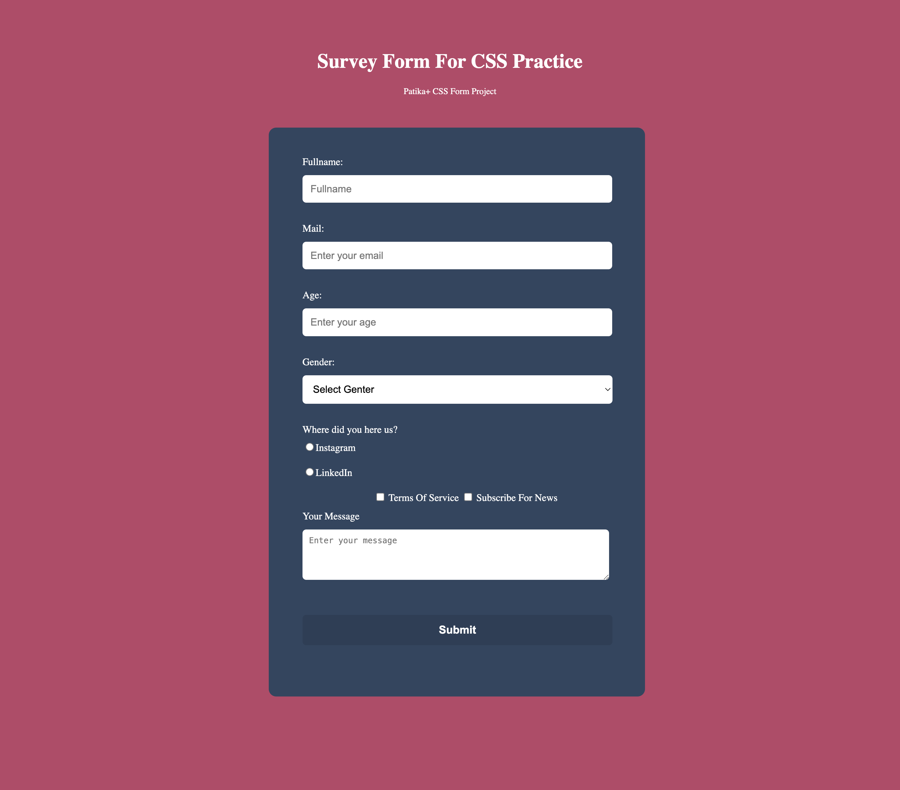

# CSS Form Project

This project is part of the **Patika+ Frontend Bootcamp**. It is a form design that adheres to specific requirements, including input validation and responsive styling. The form collects user data such as name, email, age, gender, and additional information. It is built using HTML and CSS, following best practices for form design.

## Table of Contents

- [CSS Form Project](#css-form-project)
  - [Table of Contents](#table-of-contents)
  - [Project Overview](#project-overview)
  - [Features](#features)
  - [Technologies Used](#technologies-used)
  - [Screenshots](#screenshots)

## Project Overview

This form includes the following fields:
- Full Name (text input)
- Email Address (email input)
- Age (number input with validation)
- Gender (dropdown selection)
- Source of Discovery (radio buttons)
- Terms of Service and News Subscription (checkboxes)
- Additional Comments (textarea)
- Submit Button

Each field is designed to meet specific requirements, ensuring accessibility and usability across devices.

## Features

- Responsive form layout.
- Input fields with labels for accessibility.
- HTML5 validation for email and number inputs.
- Radio buttons and checkboxes for user choices.
- A textarea for additional comments.
- A visually appealing and user-friendly design.

## Technologies Used

- **HTML5**: For the structure of the form.
- **CSS3**: For the styling and layout.

## Screenshots

Index:

