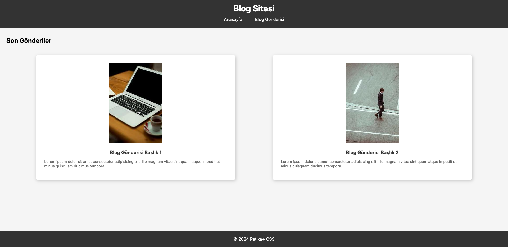

# Blog Sitesi

Bu proje, **Patika+ Ödev 1 - Blog Sitesi Tasarlama** kapsamında basit bir blog sitesi oluşturmayı amaçlamaktadır. Proje, **HTML** ve **CSS** kullanılarak geliştirilmiştir ve bir ana sayfa ile en az bir blog gönderisi sayfası içerir.

## İçerik

- `index.html`: Blog ana sayfası.
- `post.html`: Blog gönderisi sayfası.
- `style.css`: Web sitesi için stil dosyası.
- `readme.md`: Proje hakkında bilgi içeren dosya.

## Kullanılan Teknolojiler

- **HTML:** Web sayfasının temel yapısını oluşturur.
- **CSS:** Web sayfasının görünümünü ve düzenini sağlar.
- **Google Fonts:** Yazı tiplerini yönetmek için kullanılmıştır.

## Proje Yapısı

- **Ana Sayfa (index.html):**
  - Başlık ve navigasyon menüsü içerir.
  - "Son Gönderiler" bölümünde iki blog gönderisi yan yana listelenir.
  - Blog gönderilerinin her biri, görsel, başlık ve kısa özet ile gösterilir.
  - Footer, sayfanın en altında telif hakkı bilgisiyle yer alır.
  
- **Blog Gönderisi Sayfası (post.html):**
  - Tam blog gönderisini içerir.
  - Görsel, başlık ve içerik detaylarını barındırır.
  - Sayfa genişliğinin yaklaşık %90'ını kaplar ve ortalanmıştır.

## Görsel Gereksinimler

- Arka Plan: #f4f4f4
- Başlık ve Footer: #333 (koyu gri)
- Metin: #333 (başlıklar) ve #666 (paragraflar)
- Blog gönderileri beyaz kartlar şeklinde görsellenir. Kartlar gölge efekti ve yuvarlatılmış köşeler içerir.

## Ekran Görüntüleri

Ana Sayfa:

Blog Gönderisi Sayfası:
![Video]

https://github.com/user-attachments/assets/673d7c7a-1af6-43d3-a156-5850e6469440