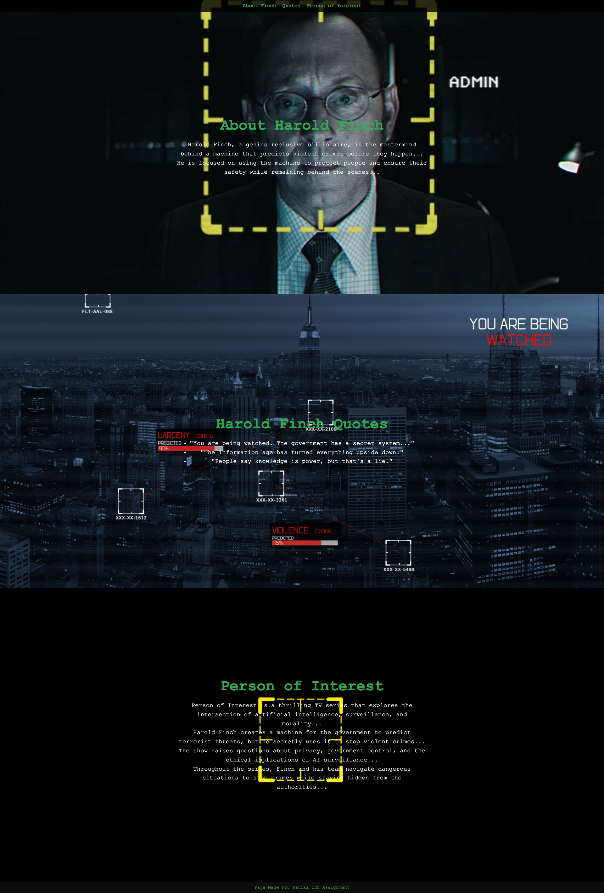

# Harold Finch Tribute Website

This project is a tribute website dedicated to Harold Finch, a central character from the TV series "Person of Interest." The website showcases his background, famous quotes, and a brief overview of the series. It is built using HTML and CSS, following a minimalist and thematic design focused on cybersecurity and surveillance.

## Table of Contents

- [Harold Finch Tribute Website](#harold-finch-tribute-website)
  - [Table of Contents](#table-of-contents)
  - [Project Overview](#project-overview)
  - [Sections](#sections)
  - [Features](#features)
  - [Technologies Used](#technologies-used)
  - [Screenshot](#screenshot)
    - [Langing Page:](#langing-page)

## Project Overview

This website is designed as a three-section page, where each section covers a different aspect related to Harold Finch and the "Person of Interest" series. Each section fills the full screen and has a unique background that fits the theme of the content.

The sections are:
- About Harold Finch.
- Harold Finch's Famous Quotes.
- Overview of the TV series "Person of Interest."

## Sections

1. **About Harold Finch**: A brief overview of Harold Finch's background, his involvement with "The Machine," and his role in preventing crimes.
  
2. **Harold Finch Quotes**: Famous quotes from Harold Finch, reflecting his perspective on surveillance, technology, and morality.

3. **Person of Interest Overview**: A few paragraphs providing an overview of the TV series "Person of Interest," focusing on its themes of artificial intelligence, privacy, and ethics.

## Features

- Full-screen sections with custom backgrounds.
- Responsive design for all screen sizes.
- Fixed navigation bar for smooth scrolling between sections.
- Simple yet effective typography and color scheme to match the cybersecurity atmosphere.
  
## Technologies Used

- **HTML5**: For the website's structure.
- **CSS3**: For styling and layout.
  
## Screenshot

### Langing Page:
