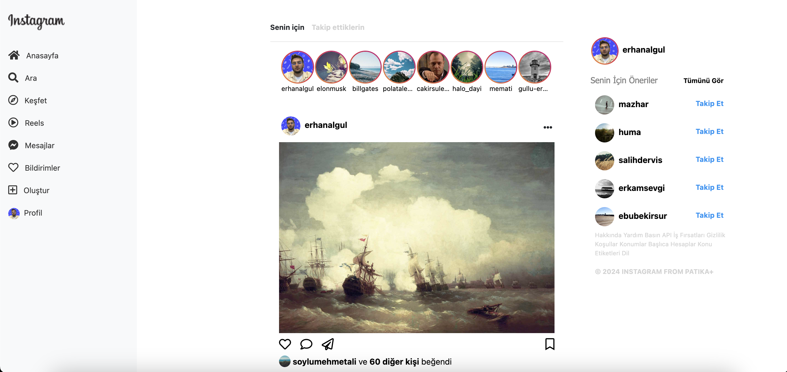
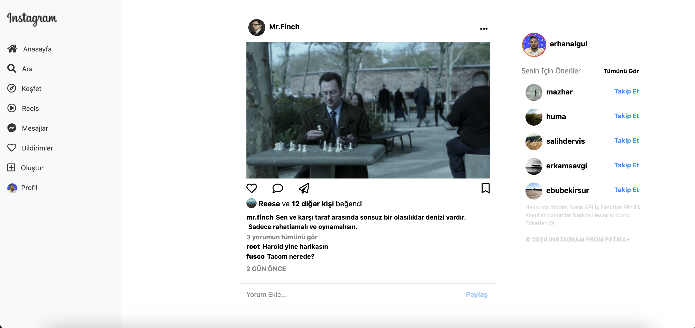

# Patika+ Instagram Web Clone Project

This project is a simple web clone of Instagram, focusing on the layout and UI design similar to Instagram's web platform. The project uses Bootstrap for responsiveness and modern styling. It's designed to replicate Instagram's core design components, such as a fixed sidebar for navigation, a central feed for posts, and a right-hand panel for additional information or suggestions.

## Table of Contents

- [Patika+ Instagram Web Clone Project](#patika-instagram-web-clone-project)
  - [Table of Contents](#table-of-contents)
  - [Features](#features)
  - [Technologies Used](#technologies-used)
  - [Screenshot](#screenshot)
  - [Video](#video)

## Features

- **Fixed Left Navigation**: A static sidebar with profile, home, search, and other menu items similar to Instagram's left-side navigation bar.
- **Central Post Feed**: Posts appear in a central feed with images, captions, and interaction buttons (like, comment, and share).
- **Fixed Right Sidebar**: Contains suggestions, user profile summary, and other relevant widgets.
- **Responsive Layout**: The layout adapts to different screen sizes, ensuring a consistent user experience across devices.
- **Profile and Story Section**: Circular images for stories, styled like Instagram's story section.
- **Bootstrap Grid System**: Utilizes Bootstrap's grid system for responsive and organized content display.

## Technologies Used

- **HTML5**: For building the basic structure of the web pages.
- **CSS3**: For custom styling and layout adjustments.
- **Bootstrap 4.5**: To ensure responsive design and use pre-built UI components.
- **FontAwesome**: For icons used in the navigation bar and post actions.

## Screenshot

## Video

