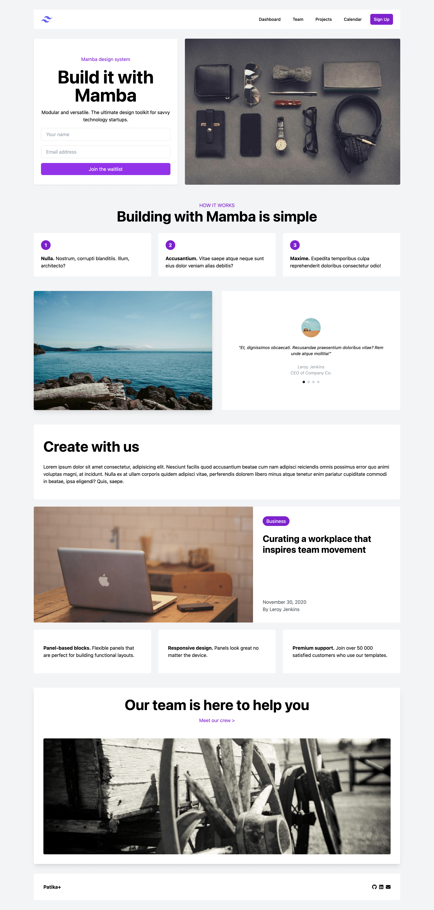

# TailwindCSS Landing Page

This project is a landing page for patika+ created using TailwindCSS, designed to provide a clean and modern interface. The landing page has a responsive layout with a navigation bar, main content area, features section, testimonial section, and footer.

## Table of Contents

- [TailwindCSS Landing Page](#tailwindcss-landing-page)
  - [Table of Contents](#table-of-contents)
  - [Overview](#overview)
  - [Features](#features)
  - [Technologies Used](#technologies-used)
  - [Screenshot](#screenshot)

## Overview

The TailwindCSS Landing Page is a simple and elegant web page designed to be responsive and user-friendly. It includes sections such as navigation, main content, features, testimonials, and footer, all styled using TailwindCSS for a modern look and feel.

## Features

- **Responsive Navigation Bar**: A navigation bar that adjusts for both desktop and mobile views. It includes links for Dashboard, Team, Projects, Calendar, and a Sign-Up button.
- **Main Content Area**: Displays a call-to-action with a form for users to join a waitlist, and a hero image highlighting the design system.
- **Features Section**: Showcases three key features of the design system with numbered steps and brief descriptions.
- **Testimonial Section**: Includes user testimonials with images and quotes to build trust and credibility.
- **Team Section**: Provides an introduction to the team with a link to meet the crew and an image showcasing the team.
- **Footer**: Contains links to social media profiles and a company name.

## Technologies Used

- **HTML5**: For the basic structure of the web pages.
- **TailwindCSS**: For modern, utility-first CSS styling.
- **FontAwesome**: For icons used in the navigation bar and footer.

## Screenshot

