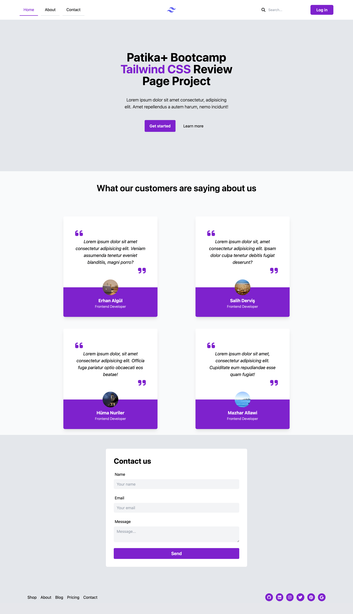

# Tailwind CSS Landing Page - Patika+ Bootcamp Project

This project is a landing page created for Patika+ Frontend Bootcamp using TailwindCSS, designed to provide a clean and modern interface. The page features a responsive layout with a navigation bar, main content area, features section, form, and footer.

## Table of Contents

- [Tailwind CSS Landing Page - Patika+ Bootcamp Project](#tailwind-css-landing-page---patika-bootcamp-project)
  - [Table of Contents](#table-of-contents)
  - [Technologies Used](#technologies-used)
  - [Screenshot](#screenshot)

## Technologies Used

- **HTML5**: For the basic structure of the web pages.
- **TailwindCSS**: For modern, utility-first CSS styling.
- **FontAwesome**: For icons used in the navigation bar and footer.

## Screenshot

