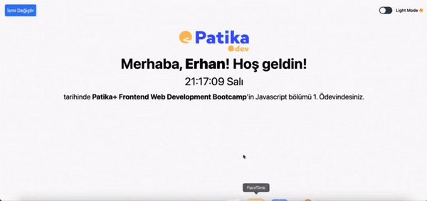

## Proje Ekran Görüntüsü

# Patika+ Javascript Saat Ödevi

Bu proje, **Patika+ Frontend Web Development Bootcamp**'in Javascript bölümünün 1. ödevi için geliştirilmiştir. Kullanıcının ismini girmesini, saat ve gün bilgisini ekranda göstermesini, ve karanlık mod (dark mode) geçişini sağlayan interaktif bir web sayfasıdır.

## Proje İçeriği

Proje, aşağıdaki özellikleri içermektedir:
- Kullanıcıdan isim girişi alır ve ismi ekranda gösterir.
- Ekranda anlık olarak saat ve gün bilgisini Türkçe formatında gösterir.
- Kullanıcı, "İsmi Değiştir" butonu ile adını güncelleyebilir.
- Karanlık Mod (Dark Mode) özelliği vardır ve bu mod geçişi, kullanıcının tercihine göre dinamik olarak güncellenir.

## Kullanılan Teknolojiler

- **HTML5**: Sayfanın yapısal iskeletini oluşturmak için.
- **Tailwind CSS**: Stil yönetimi için kullanılmıştır.
- **JavaScript**: Dinamik içerik ve saat/gün bilgilerini göstermek, kullanıcı etkileşimlerini yönetmek için kullanılmıştır.

## Proje Özellikleri

1. **İsim Girişi ve Güncelleme**: 
   - Kullanıcı ilk başta bir `prompt` ile karşılanır ve ismi ekranda gösterilir.
   - "İsmi Değiştir" butonuna basarak, kullanıcı adını değiştirebilir.

2. **Saat ve Gün Bilgisi**:
   - Ekranda anlık olarak saat ve gün bilgisi Türkçe formatında gösterilmektedir.
   - Bu bilgi her saniye güncellenir.

3. **Karanlık Mod (Dark Mode)**:
   - Kullanıcı karanlık mod geçişini bir `toggle switch` ile kontrol edebilir.
   - Karanlık mod aktif olduğunda metin ve arka plan renkleri otomatik olarak değişir.

