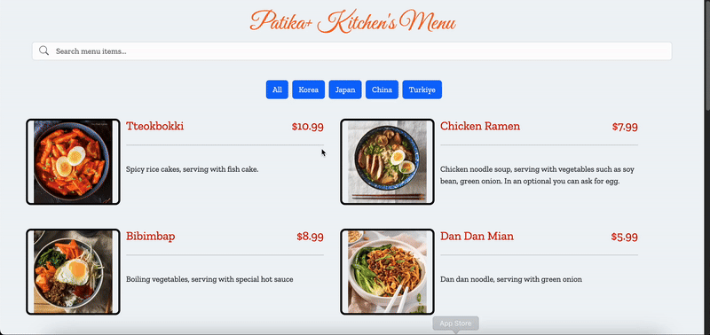

# Patika+ Kitchen's Menu

Bu uygulama, kullanıcının bir restoran menüsünü filtrelemesine ve arama yapmasına olanak sağlayan dinamik bir menü uygulamasıdır. Menü öğeleri filtrelenebilir ve her öğe başlık, açıklama ve fiyat gibi bilgileri içerir. Arama çubuğu kullanılarak menüdeki öğeler başlık veya açıklamaya göre aranabilir.

## Ekran Görüntüleri
  

## Özellikler

- Filtreleme Butonları: Her kategori için bir buton bulunur. Kullanıcı, kategoriye göre menüyü filtreleyebilir.
- Arama Fonksiyonu: Arama çubuğuna yazılan kelimeye göre menüdeki başlık ve açıklamalarda eşleşen öğeler listelenir.
- Responsive Tasarım: Bootstrap ile responsive bir yapı oluşturulmuştur, böylece tüm cihazlarda uygun görünür.
- Duyarlı Arama: Büyük-küçük harf duyarsız arama yapılabilir.

## Kullanım

1. **Kategori Filtreleme**: Menüdeki belirli bir kategoriye tıklayarak yalnızca o kategorideki menü öğelerini görebilirsiniz.
2. **Arama Yapma**: Arama çubuğuna menüdeki öğelerle ilgili bir kelime yazarak başlık veya açıklama üzerinden arama yapabilirsiniz.
3. **Tüm Öğeleri Görüntüleme**: "All" butonuna tıklayarak tüm menü öğelerini tekrar listeleyebilirsiniz.

## Teknolojiler

- HTML5
- CSS
- JavaScript
- Bootstrap 5
- Bootstrap Icons
- Google Fonts

