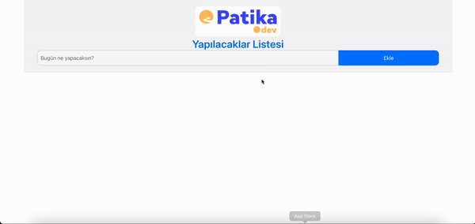

# PATİKA+ To Do List Uygulaması

Bu proje, kullanıcıların görevlerini ekleyip kaldırabileceği basit bir yapılacaklar listesi uygulamasıdır. Uygulama, Bootstrap kullanarak modern bir arayüze sahip ve kullanıcı dostu bir deneyim sunmaktadır.

## Ekran Görüntüleri
  

## Özellikler

- Görev ekleme ve silme
- Görev tamamlandığında işaretleme
- Bootstrap ile tasarlanmış responsive arayüz
- Kullanıcı dostu bildirimler (Toast) ile geri bildirim

## Kullanım

1. **Görev Ekleme**: "Bugün ne yapacaksın?" alanına bir görev girin ve "Ekle" butonuna tıklayın.
2. **Görev Silme**: Eklediğiniz görevlerin yanındaki çarpı butonuna tıklayarak görevleri silebilirsiniz.
3. **Tamamlanan Görevler**: Görevlerin üzerine tıklayarak onları tamamlanmış olarak işaretleyebilirsiniz.

## Teknolojiler

- HTML
- CSS
- JavaScript
- Bootstrap

