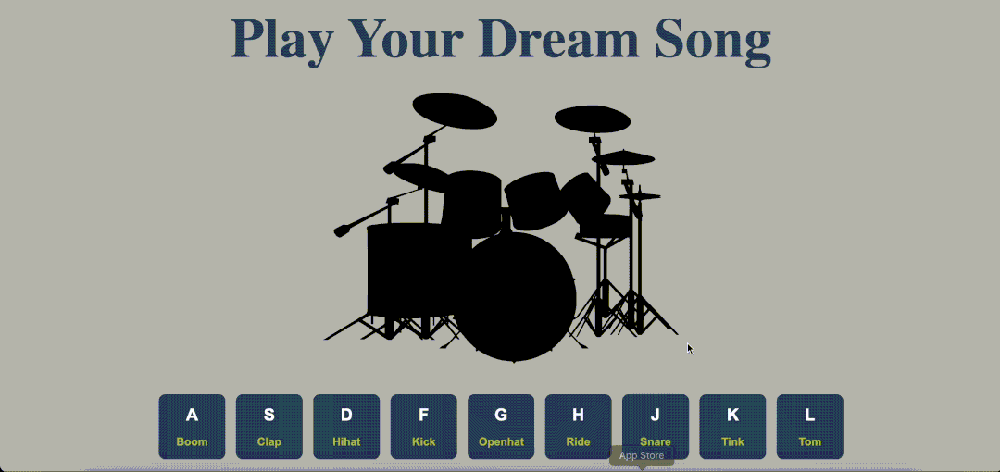

## Ekran Görüntüleri

# JavaScript Drum Kit

Bu proje, kullanıcıların hem klavye tuşlarına basarak hem de fare ile butonlara tıklayarak farklı davul seslerini çalabilmesini sağlayan bir drum kit uygulamasıdır. Bu uygulama, JavaScript, HTML ve CSS kullanılarak geliştirilmiştir.

## Proje İçeriği

- **HTML**: Sayfa yapısı ve butonların yerleşimi için.
- **CSS**: Butonların ve sayfanın görünümü, responsivity (farklı ekran boyutlarına uyum).
- **JavaScript**: Ses oynatma, tuş vuruşlarını yakalama ve kullanıcı etkileşimi.

