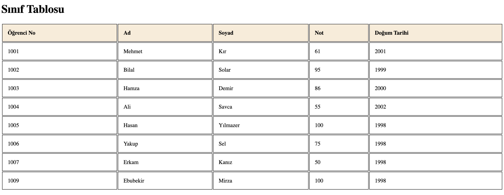

Kurs başlangıcında olduğumuz için gösterildiği gibi Inline CSS ile projeyi yaptım.

Tablonun genişliğini %100 olarak ayarlandı.

Hücrelerin kenarlıklarını belirleyin ve padding eklendi.

Tablo başlık satırının (th) arka plan rengi düzenlendi.

Doğum Tarihi bilgileri eklenerek proje sonlandırıldı.

## Screnshoot

