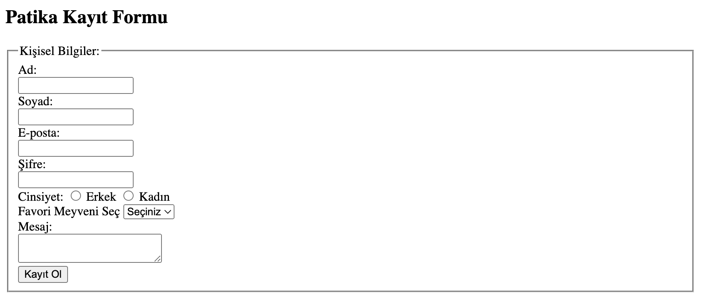

# Patika Kayıt Formu

Bu proje, Patika+ ödevi için basit bir kayıt formu oluşturmak amacıyla hazırlanmıştır. HTML kullanılarak oluşturulan form, kullanıcıların kişisel bilgilerini, e-posta adreslerini, şifrelerini ve tercihlerini girmelerini sağlar.

## İçerik

- **Ad/Soyad Girişi:** Kullanıcılardan ad ve soyad bilgilerini almaktadır.
- **E-posta Girişi:** Kullanıcının geçerli bir e-posta adresi girmesi beklenir.
- **Şifre Girişi:** Güvenli bir şekilde şifre girilmesi için şifre alanı bulunmaktadır.
- **Cinsiyet Seçimi:** Kullanıcı cinsiyetini erkek veya kadın olarak seçebilir.
- **Favori Meyve Seçimi:** Kullanıcı favori meyvesini seçebilir.
- **Mesaj Alanı:** Kullanıcılar ek bilgi girebilir.
- **Kayıt Butonu:** Formu gönderme işlemi bu buton ile gerçekleştirilir.

## Form Yapısı

Form, `fieldset` ve `legend` etiketleri ile bölümlenmiştir. Her giriş alanı, `label` etiketi ile birlikte kullanılmıştır, bu da formun daha erişilebilir olmasını sağlar.

- **`required` Attribute:** Giriş alanlarında, kullanıcının ilgili alanı doldurması zorunlu kılınmıştır.
- **`type="email"`:** E-posta alanı, sadece geçerli bir e-posta formatında giriş yapılmasına izin verir.
- **`type="password"`:** Şifre alanı, girilen karakterlerin gizlenmesini sağlar.

