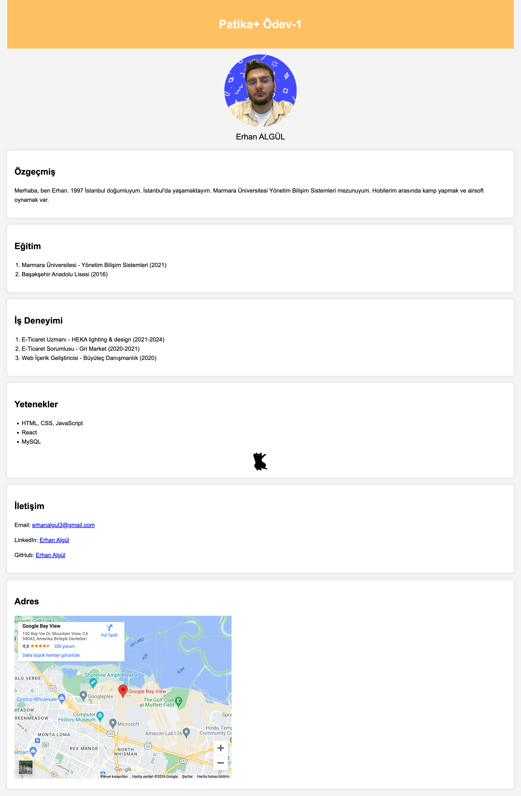

# Erhan Algül Kişisel Sayfa

Bu proje, patika+ ödevi için HTML ve CSS kullanılarak oluşturulmuş bir kişisel sayfadır. Bu sayfa, kendinizi tanıtmak, eğitim ve iş deneyimlerinizi paylaşmak, yeteneklerinizi sergilemek ve iletişim bilgilerinizi sunmak için kullanılabilir.

## İçindekiler

- [Erhan Algül Kişisel Sayfa](#erhan-algül-kişisel-sayfa)
  - [İçindekiler](#i̇çindekiler)
  - [Genel Bakış](#genel-bakış)
  - [Yapı](#yapı)
  - [Kullanılan Teknolojiler](#kullanılan-teknolojiler)
  - [Ekran Görüntüleri](#ekran-görüntüleri)

## Genel Bakış

Bu sayfa, basit bir kişisel web sayfasının nasıl oluşturulacağını öğrenmek isteyen yeni başlayanlar için tasarlanmıştır. Sayfa; özgeçmiş, eğitim, iş deneyimi, yetenekler, iletişim ve adres gibi bölümleri içerir.

## Yapı

Sayfa, aşağıdaki temel bölümlerden oluşmaktadır:
1. **Özgeçmiş**: Kendinizi tanıtan kısa bir metin.
2. **Eğitim**: Eğitim geçmişinizi listeleyen bir bölüm.
3. **İş Deneyimi**: İş deneyimlerinizi kronolojik sırayla sunan bir liste.
4. **Yetenekler**: Sahip olduğunuz becerileri listeleyen bir bölüm.
5. **İletişim**: İletişim bilgilerinizi içerir.
6. **Adres**: Google Maps kullanılarak bir harita gösteren bölüm.

## Kullanılan Teknolojiler

- **HTML5**: Sayfanın yapısı için.
- **CSS3**: Sayfanın stilini düzenlemek için.

## Ekran Görüntüleri
  

