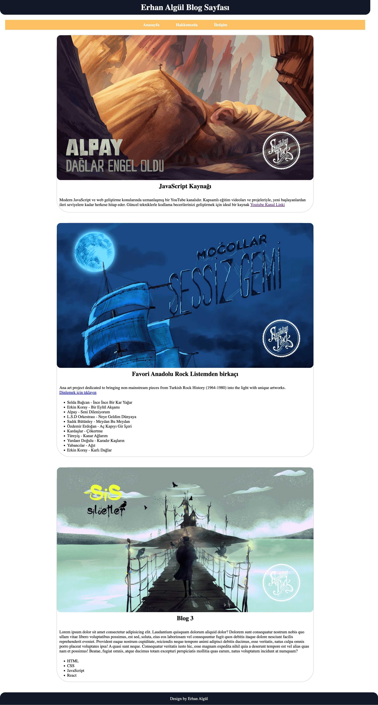

# Kişisel Blog Sayfası

Bu proje, patika+ Ödev 2 - Kişisel Blog Sayfası Oluşturma için temel HTML5 yapı taşları kullanılarak oluşturulmuş bir kişisel blog sayfasıdır. Sayfa, blog yazıları, görseller, listeler ve bağlantılar içermektedir.

## Genel Yapı

- **HTML5 Doküman Yapısı**: Sayfanızın temel yapısını oluşturmak için HTML5 doküman yapısı kullanılmıştır.
- **Başlık ve Karakter Seti**: `<head>` etiketinin içinde sayfanın başlığı (`<title>`) ve karakter seti (`<meta charset="UTF-8">`) belirtilmiştir. Semantik yapı kullanılmıştır. Internal CSS kullanılmıştır.
- Linkleme olarak youtube sayfaları seçilmiştir.

## Kullanılan Teknolojiler

- HTML5
- CSS (Stil düzenlemeleri için)

## Ekran Görüntüleri
  
