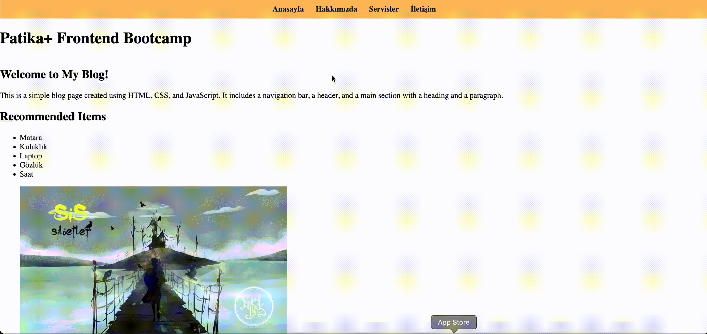

# Rehber Web Sitesi

Bu proje, patika+ Ödev 3 - Rehber Web Sitesi Oluşturma için bir rehber web sitesi oluşturmayı amaçlamaktadır. Proje, HTML ve CSS kullanarak yapılandırılmıştır.

## İçerik

- `index.html`: Anasayfa
- `hakkimizda.html`: Hakkımızda sayfası
- `servisler.html`: Servisler sayfası
- `iletisim.html`: İletişim sayfası
- `readme.md`: Proje hakkında bilgi içeren dosya

## Kullanılan Teknolojiler

- **HTML:** Web sayfasının temel yapısını oluşturur.
- **CSS:** Web sayfasının stilini ve düzenini sağlar.

## Proje Yapısı

- **Ana Sayfa (index.html):** Projenin ana sayfası.
- **Hakkımızda (hakkimizda.html):** Şirket hakkında bilgi veren sayfa.
- **Servisler (servisler.html):** Verilen hizmetlerin detaylarını içerir.
- **İletişim (iletisim.html):** İletişim bilgilerini sunar.

## Ekran Görüntüleri
  